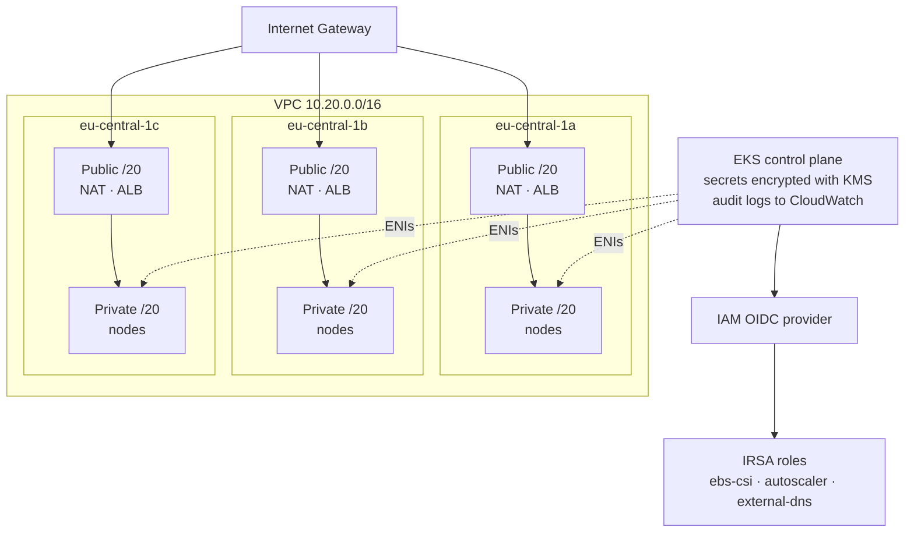

# terraform-aws-eks-platform

Production-shaped EKS clusters from a single module. Private-subnet nodes, IRSA wired for every controller that needs AWS access, secrets encrypted with a customer-managed key, and a CI pipeline that refuses to merge a plan with a HIGH finding in it.

Built to be read as much as run — every non-obvious decision has a comment explaining the tradeoff rather than just the setting.

```hcl
module "platform" {
  source = "github.com/favy12/terraform-aws-eks-platform"

  name        = "platform"
  environment = "prod"
  region      = "eu-central-1"

  vpc_cidr           = "10.20.0.0/16"
  availability_zones = ["eu-central-1a", "eu-central-1b", "eu-central-1c"]

  node_groups = {
    general = {
      instance_types = ["m6i.xlarge"]
      desired_size   = 3
      min_size       = 3
      max_size       = 12
    }
  }
}
```

---

## Architecture



Three availability zones, two subnet tiers. Nodes never get a public IP; egress goes through a NAT gateway per AZ so one AZ losing its NAT does not take the other two offline. The control plane places its ENIs in the private subnets, and the API endpoint is reachable only from CIDRs you name.

Subnets carry the `kubernetes.io/role/elb` and `kubernetes.io/role/internal-elb` tags, which is what lets the AWS Load Balancer Controller work out where to put a `Service type=LoadBalancer`. Miss those tags and provisioning fails with an error that names nothing useful.

---

## What it sets up

| Area | Decision |
| --- | --- |
| **Networking** | 3 AZs, public/private tiers, per-AZ NAT in prod and a shared one in dev, flow logs capturing `REJECT` only |
| **Control plane** | Envelope encryption of Kubernetes secrets with a rotating customer-managed KMS key; all five log types shipped with explicit retention |
| **Identity** | OIDC provider plus a reusable IRSA module — every role pinned to one exact `namespace/serviceaccount`, never a wildcard |
| **Nodes** | Managed node groups, SSM instead of SSH keys, spot pools spread across instance families, `desired_size` drift ignored so autoscaling and Terraform stop fighting |
| **Addons** | `vpc-cni`, `kube-proxy`, `coredns`, `aws-ebs-csi-driver` — versions pinned in prod, `PRESERVE` on update so in-cluster changes survive an apply |
| **CI** | fmt, validate per module, tflint, Trivy and Checkov as blocking gates, plan posted to the PR, OIDC federation so no AWS keys live in secrets |

---

## Layout

```
.
├── main.tf                  # composes the three modules
├── variables.tf
├── outputs.tf
├── modules/
│   ├── network/             # VPC, subnets, NAT, routing, flow logs
│   ├── eks/                 # control plane, KMS, OIDC, node groups
│   ├── irsa/                # reusable service-account → IAM role binding
│   └── addons/              # managed addons + controller IRSA roles
└── environments/
    ├── dev/                 # spot nodes, one NAT, no flow logs
    └── prod/                # 3 node groups, pinned addons, restricted API
```

---

## Usage

```bash
cd environments/dev

# Point the backend at a bucket you own first — see backend block in main.tf
terraform init
terraform plan
terraform apply

aws eks update-kubeconfig --region eu-central-1 --name platform-dev
kubectl get nodes
```

Wiring a workload to AWS without static credentials:

```hcl
module "app_irsa" {
  source = "./modules/irsa"

  role_name            = "orders-api"
  oidc_provider_arn    = module.platform.oidc_provider_arn
  oidc_provider_url    = module.platform.oidc_provider_url
  namespace            = "orders"
  service_account_name = "orders-api"
  inline_policy_json   = data.aws_iam_policy_document.orders.json
}
```

Then annotate the service account with `eks.amazonaws.com/role-arn` set to the module's `role_arn` output.

---

## Cost

Rough monthly figures, eu-central-1, on-demand:

| | dev | prod |
| --- | --- | --- |
| Control plane | $73 | $73 |
| NAT gateways | $32 (1) | $97 (3) |
| Nodes | ~$50 (2× t3.large spot) | ~$560 (3× m6i.large + 3× m6i.xlarge) |
| Logs & flow logs | minimal | $20–60 depending on traffic |
| **Total** | **~$155** | **~$750+** |

The dev/prod split exists mainly to keep NAT and node cost sane in environments where an AZ outage overnight has no consequence. If dev cost still matters more than dev fidelity, drop to two AZs.

---

## Deliberately not included

- **AWS Load Balancer Controller** — the IAM policy is ~200 lines maintained upstream, and vendoring a stale copy is worse than pointing at the current one. Add it with the IRSA module and the [upstream policy](https://github.com/kubernetes-sigs/aws-load-balancer-controller/blob/main/docs/install/iam_policy.json).
- **Helm releases** — this repo stops at infrastructure. Application delivery belongs in Argo CD, which is the GitOps boundary; mixing `helm_release` into Terraform state makes both harder to reason about.
- **Fully private API endpoint** — supported by setting `endpoint_public_access = false`, but it needs a bastion or VPN to be usable, which is a separate decision.

---

## Verification

```bash
terraform fmt -check -recursive
terraform init -backend=false && terraform validate
tflint --recursive
trivy config .
```

CI runs all four on every PR. `plan` output is posted as a PR comment for both environments.

---

## License

MIT — see [LICENSE](LICENSE).
